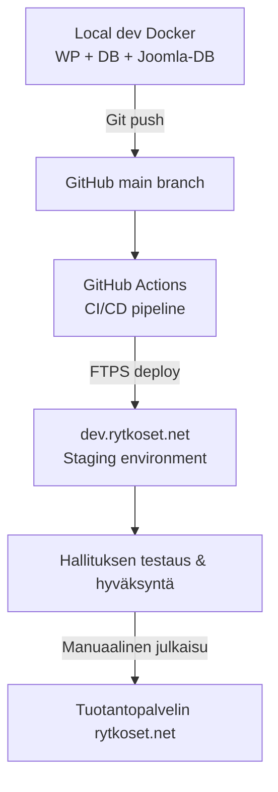

# 🐦 Rytköset.net – WordPress-projekti

Tämä repository sisältää Rytkösten Sukuseura ry:n uuden WordPress-sivuston kehityksen.  
Projektissa käytetään modernia local-dev -ympäristöä (Docker), erillistä Joomla-importtia, automaattista dev-deployta sekä GitHub Actions -pohjaista CI/CD-putkea.

---

## 🚀 Kehitysympäristö (Docker)

Paikallinen kehitys tehdään Dockerilla. Projektissa on kolme konttia:

- **wordpress** – PHP 8.3 + Apache  
- **db** – MariaDB 10.11 (WordPress)  
- **joomla-db** – MariaDB 10.11 (Joomla-migraatiota varten)

### 🔧 Käynnistys

```bash
docker compose up -d
```

🛑 Sammutus

```bash
docker compose down
```

🌍 WordPress kehityksessä

http://localhost:8000

📦 Joomla-migraatio

Migraatio tehdään erilliseen joomla-db -konttiin.
1. Kopioi Joomla SQL dump konttiin

```bash
docker cp _db-dumps/joomla.sql rytkoset-joomla-db:/joomla.sql
```

2. Aja SQL sisään

```bash
docker exec -it rytkoset-joomla-db bash
mysql -u root -p joomla_db < /joomla.sql
```

3. Suorita FG Joomla Premium -import WordPressin administa

Tools → FG Joomla to WordPress → Run Import

🌱 Dev / Staging -ympäristö

Käytössä on staging-ympäristö, jota hallituksen jäsenet voivat käyttää arviointiin:

🔗 https://dev.rytkoset.net

Dev-ympäristö päivittyy automaattisesti vain teeman muutoksista (tyyli, ulkoasu, template).

🔄 Dev-datan päivittäminen tuotannosta

Dev-sivuston sisältö voidaan päivittää tuotannosta All-in-One Migrationilla:

1. Ota export tuotantoympäristöstä
2. Nosta devin upload-limiitti .htaccess-muutoksella:

```apache
php_value upload_max_filesize 64M
php_value post_max_size 64M
php_value max_execution_time 300
php_value max_input_time 300
```

3. Import deviin
4. Valitse: Replace matching content only

Admin-käyttäjä säilyy devissä

Dev on nyt 1:1 kopio tuotannosta sisältöjen osalta.

⚙️ CI/CD – Automaattinen teeman deploy deviin

Kun main-branchiin pusketaan muutos, joka koskee:

`wp-content/themes/rytkoset-theme/**`

GitHub Actions:

- Checkouttaa koodin
- Lähettää muutokset FTPS:llä
- Päivittää teeman suoraan dev.rytkoset.net -palvelimelle

Workflow-tiedosto (.github/workflows/deploy-dev.yml)

```yaml
name: Deploy theme to dev.rytkoset.net

on:
  push:
    branches:
      - main
    paths:
      - 'wp-content/themes/rytkoset-theme/**'

jobs:
  deploy:
    runs-on: ubuntu-latest

    steps:
      - name: Checkout repo
        uses: actions/checkout@v4

      - name: Deploy via FTP
        uses: SamKirkland/FTP-Deploy-Action@v4
        with:
          server: ${{ secrets.FTP_HOST }}
          username: ${{ secrets.FTP_USERNAME }}
          password: ${{ secrets.FTP_PASSWORD }}
          port: ${{ secrets.FTP_PORT }}
          protocol: ftps
          local-dir: wp-content/themes/rytkoset-theme/
          server-dir: /wp-content/themes/rytkoset-theme/
          log-level: standard
```

🧩 Arkkitehtuurikaavio (Mermaid)



🛠️ Julkaisuprosessi

- Kehitä Dockerissa
- Commit → push → teema päivittyy automaattisesti deviin
- Hallitus hyväksyy dev-version
- Teeman päivitys siirretään manuaalisesti tuotantoon

📝 Changelog

Changelog löytyy tiedostosta:

👉 CHANGELOG.md