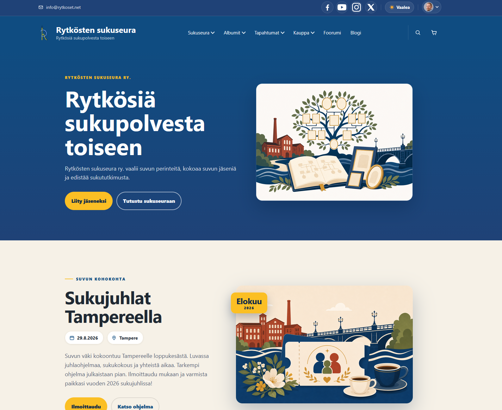
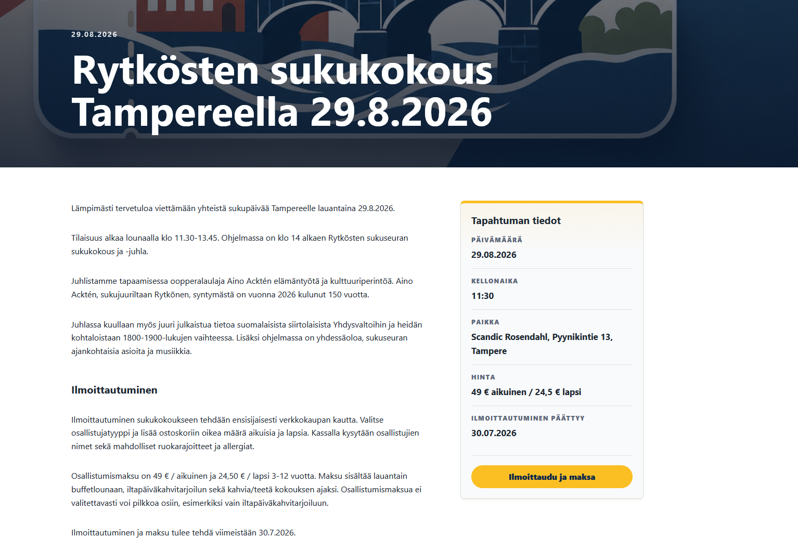
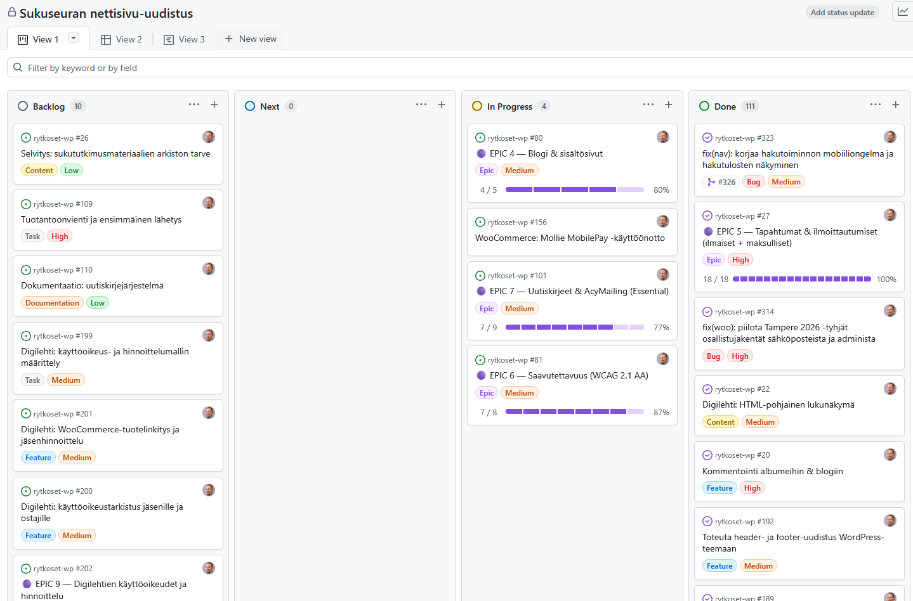

# Rytköset.net WordPress-projekti

Tämä repository sisältää Rytkösten sukuseura ry:n verkkosivuston WordPress-teeman,
erillisiä `wp-content`-operointitiedostoja ja projektidokumentaation.

Kyseessä on oikea tuotantoprojekti. Päätavoite on ylläpidettävä, suomenkielinen
WordPress-sivusto ei-teknisille käyttäjille. Sivusto tukee sisältöjä,
tapahtumia, mediaa, jäsenmaksuja ja viestintää.

Tuotantosivusto:

- `https://rytkoset.net`

Dev-ympäristö:

- `https://dev.rytkoset.net`

## About this project (English summary)

Production WordPress site for a Finnish family association (Rytkösten sukuseura ry).
The repository contains a hand-built custom theme, a few standalone `wp-content`
operational files, and the project documentation — no page builder, no heavy
frontend framework. Highlights: custom
post types for events, registrations and photo galleries; WooCommerce extensions
for memberships and paid events; an AcyMailing newsletter integration; a Dockerized
local environment; and GitHub Actions for PHP validation and FTPS deploys.

It is also a hands-on study in **AI-assisted ("agentic") development** — see the
section below. The rest of this README is in Finnish, matching the project's own
language.

## Kuvakaappaukset

_Etusivu — split-hero ja vuorottelevat vaaleat/tummat sisältöbändit._

_Yksittäisen tapahtuman sivu._

_Työn etenemistä seurataan yksityisellä GitHub Projects -taululla epic → feature → task -mallilla._

## Mitä projekti osoittaa

Tämä repo toimii esimerkkinä käytännönläheisestä WordPress-kehityksestä, jossa
painotus on ylläpidettävyydessä, pienissä toimitettavissa kokonaisuuksissa ja
WordPressin omien rakenteiden hyödyntämisessä.

Teknisiä nostoja:

- custom WordPress -teema ilman raskasta frontend-frameworkia
- Docker-pohjainen paikallinen kehitysympäristö
- GitHub Actions -pohjainen PHP-validointi ja FTPS-deploy
- custom post type -toteutukset tapahtumille, ilmoittautumisille ja gallerioille
- WooCommerce-laajennukset jäsenmaksuille ja maksullisille tapahtumille
- AcyMailing-uutiskirjeintegraatio
- PhotoSwipe 5 -galleria WordPressin mediatiedostojen päällä
- saavutettavuus- ja ylläpidettävyysdokumentaatio

## AI-avusteinen kehitys

Projekti on toteutettu pitkälti AI-avusteisesti, ja se on samalla toiminut
oppimisalustana agenttiselle kehitykselle. Työkalut ovat vaihtuneet projektin
edetessä:

- **ChatGPT** — alkuvaiheen suunnittelu, arkkitehtuuripohdinta ja ensimmäiset toteutukset.
- **Codex** — siirtyminen agenttisempaan, repoa suoraan muokkaavaan työskentelyyn.
- **Claude Code** — rinnakkainen tekoälytyökalu (käytössä noin toukokuusta 2026): suunnittelu, toteutus, koodikatselmointi ja dokumentointi.
- **Claude Design** — ulkoasun suunnittelu.

Repo on rakennettu tukemaan tätä työtapaa:

- `AGENTS.md` — projektin kehitysperiaatteet ja AI-yhteistyön säännöt
- `CLAUDE.md` — Claude Coden tekninen ohjeistus ja arkkitehtuurimuistiinpanot
- issue- ja epic-pohjainen GitHub Projects -taulu sekä PR- ja issue-pohjat
- pieni, katselmoitava etenemismalli (conventional commits, manuaalinen `CHANGELOG.md`)

Tavoitteena ei ole ollut antaa AI:n generoida valmiita kokonaisuuksia, vaan käyttää
sitä ajattelun ja katselmoinnin kumppanina — pienin, ymmärrettävin askelin.

## Nykyinen rajaus

Versionhallinnassa oleva varsinainen sovelluskoodi on custom-teema:

- `wp-content/themes/rytkoset-theme/`

Lisäksi repossa on rajatusti erillisiä `wp-content`-operointitiedostoja:

- `wp-content/maintenance.php`
- `wp-content/mu-plugins/automation-by-klik.php`

WordPressin ydintiedostot, asennetut lisäosat ja tuotannon mediatiedostot eivät
ole tässä repossa.

Keskeiset toiminnallisuudet:

- sivut, blogi/uutiset ja navigaatio
- galleria-albumit ja PhotoSwipe 5
- tapahtumat, maksuttomat ilmoittautumiset, osallistujahallinta ja viestintä
- WooCommerce-jäsenmaksut ja maksulliset tapahtumamaksut
- AcyMailing-uutiskirjeintegraatio
- digilehdet HTML-sisältönä (lehdet ja jutut, arkisto `/digilehdet/`)

Claude Coden tekninen ohjeistus on tiedostossa `CLAUDE.md`. Tarkemmat
ominaisuusohjeet ovat hakemistossa `docs/`.

## Paikallinen kehitys

Paikallinen ympäristö toimii Docker Composella.

- Mitä tekee: käynnistää WordPressin ja MariaDB:n.
- Kohde: paikallinen Docker-ympäristö.
- Komento: `docker compose up -d`

WordPress löytyy paikallisesti osoitteesta:

- `http://localhost:8000`

Ympäristön pysäytys:

- Mitä tekee: pysäyttää paikalliset Docker-kontit.
- Kohde: paikallinen Docker-ympäristö.
- Komento: `docker compose down`

Kontit:

- `rytkoset-wp` - WordPress / PHP 8.3 / Apache
- `rytkoset-db` - MariaDB 10.11 WordPressille
- `wpcli` - pyydettäessä käynnistyvä WP-CLI-palvelu yksittäisiin komentoihin (ei käynnisty `docker compose up`:lla, `cli`-profiili). Käyttö: `docker compose run --rm wpcli wp <komento>`

Vain `wp-content/` on mountattu hostilta konttiin. Teemamuutokset näkyvät ilman
kontin uudelleenrakennusta.

Ensimmäinen käynnistys:

- Tietokannan tunnukset tulevat suoraan `docker-compose.yml`-tiedostosta — erillistä `.env`-tiedostoa ei tarvita paikallisesti.
- WordPressin ydin tulee Docker-imagesta (`wordpress:7-php8.3-apache`). Tietokanta on alussa tyhjä, joten ensimmäisellä käynnillä `http://localhost:8000` ohjaa WordPressin asennusvelhoon.
- Lisäosat (WooCommerce, AcyMailing) eivät ole repossa, vaan ne asennetaan WordPressin kautta. Teema toimii ilman niitäkin, mutta osa toiminnoista vaatii ne. PhotoSwipe 5 on vendoroitu teemaan (`assets/vendor/photoswipe/`).

## Validointi

Projektissa ei ole Node-pohjaista build-vaihetta. `.github/workflows/php-ci.yml`
ajaa jokaiselle PR:lle ja `main`-branchin pushille kolme kovaa porttia: PHP-syntaksitarkistuksen,
PHPCS/WordPress Coding Standardsin ja PHPUnit-testit.

PHP-syntaksitarkistus:

- Mitä tekee: ajaa PHP-syntaksitarkistuksen kaikille teeman PHP-tiedostoille.
- Kohde: `wp-content/themes/rytkoset-theme/`.
- Komento: `find wp-content/themes/rytkoset-theme -name "*.php" -print0 | xargs -0 -n1 php -l`

PHPCS / WordPress Coding Standards ja PHPUnit-yksikkötestit ovat Composer-riippuvuuksia
(`composer.json`, ainoa Composer-käyttö repossa; `vendor/` on gitignoroitu). PHPCS
tarkistaa teeman lisäksi `wp-content/maintenance.php`- ja `wp-content/mu-plugins/`-polut,
jotta versionhallinnassa olevat erilliset operointitiedostot eivät jää CI:n ulkopuolelle.
PHPUnit-testit (`tests/`) ovat kevyitä yksikkötestejä ilman WordPress-testiasennusta —
`tests/bootstrap.php` määrittelee juuri sen verran WordPress/WooCommerce-stubeja, että
teeman moduulit latautuvat ilman tietokantaa.

- Asennus (kertaalleen): `composer install`
- Lint: `composer run lint` (`composer run lint:fix` korjaa automaattisesti osan löydöksistä)
- Testit: `composer run test`

Jos PHP ei ole asennettuna paikallisesti, komennot voi ajaa Dockerin kautta, esim.
`docker compose run --rm -v "$PWD":/app -w /app --entrypoint sh wordpress -lc 'vendor/bin/phpunit'`.

## Branchit ja deployt

Branch-malli:

- `dev` deployaa automaattisesti `dev.rytkoset.net`-ympäristöön, kun teematiedostot muuttuvat.
- `main` on pääasiallinen integraatiobranch, eikä se deployaa automaattisesti deviin.

Dev-deploy:

- Workflow: `.github/workflows/deploy-dev.yml`
- Trigger: push `dev`-branchiin
- Polkurajaus: `wp-content/themes/rytkoset-theme/**`
- Menetelmä: FTPS
- Kohde: `dev.rytkoset.net`
- Huom: dev-deploy vie vain teeman. `wp-content/maintenance.php` ja
  `wp-content/mu-plugins/` eivät deployaudu tällä workflowlla.

Tuotantodeploy:

- Workflow: `.github/workflows/deploy-production.yml`
- Trigger: manuaalinen `workflow_dispatch`
- Oletuslähde: `main`
- Menetelmä: FTPS
- Kohde: `rytkoset.net`
- Huom: tuotantoworkflow vie oletuksena vain teeman.

Tuotantoon ei deployata automaattisesti. Tämä on tarkoituksellinen rajaus.

## Projektin rakenne

Tärkeät polut:

- `wp-content/themes/rytkoset-theme/` - custom-teema
- `wp-content/themes/rytkoset-theme/inc/` - teeman toiminnalliset moduulit
- `wp-content/themes/rytkoset-theme/assets/` - CSS, JavaScript, ikonit ja kuvat
- `wp-content/maintenance.php` - brändätty WordPressin huoltotilasivu
- `wp-content/mu-plugins/automation-by-klik.php` - Klikin hallinnoiman ylläpidon
  MU-pluginin repoitu kopio; ei automaattisesti deployattava teematiedosto
- `scripts/backup.sh` - palvelimelle erikseen asennettava off-site-varmistuksen
  skriptipohja; ei kuulu teeman automaattiseen deployhin
- `docs/` - ominaisuus- ja ylläpitodokumentaatio
- `.github/workflows/` - CI- ja deploy-workflowt
- `CHANGELOG.md` - manuaalinen muutoshistoria
- `AGENTS.md` - repo-ohjeet AI-avusteiseen kehitykseen
- `CLAUDE.md` - tekniset arkkitehtuurimuistiinpanot

Teeman moduuleissa on muun muassa tapahtumat, ilmoittautumiset, galleriat,
mediajärjestys, uutiskirje, WooCommerce-toiminnot, kirjautumissivun brändäys,
SEO-metatiedot, some-linkit ja Customizer-asetukset.

## Dokumentaatio

Lue aiheeseen liittyvä dokumentti ennen ominaisuuden muuttamista:

- `docs/hallituksen-paatettavat-asiat.md` - hallituksen päätettävät verkkosivustoasiat ja päätösrungot
- `docs/design-system.md` - design-tokenit ja frontend-käytännöt
- `docs/menu-structure.md` - päävalikon tavoiterakenne
- `docs/comments.md` - blogin ja albumien kommentointi
- `docs/events.md` - tapahtuma-CPT ja ilmoittautumisvirta
- `docs/event-participants-admin.md` - osallistujahallinta
- `docs/event-participants-messaging.md` - tapahtumaviestien lähetysjono
- `docs/media-saavutettavuus.md` - median ja gallerioiden saavutettavuus
- `docs/media-library-ordering.md` - mediakirjaston ja albumien kuvajärjestys
- `docs/digital-magazines.md` - digilehtien sisältö-, käyttöoikeus- ja hinnoittelumalli
- `docs/jasenyys.md` - käyttäjän jäsenyystilan asettaminen
- `docs/jasenille-rajatut-sivut.md` - vain jäsenille näkyvät sisältösivut
- `docs/newsletter.md` - AcyMailing-uutiskirjeintegraatio
- `docs/chat.md` - AI-tukichatin backend-proxy, widget ja ylläpito
- `docs/woocommerce-setup.md` - WooCommercen perusasetukset
- `docs/woocommerce-membership-products.md` - jäsenmaksutuotteet
- `docs/woocommerce-jasenalennus.md` - jäsenyyteen sidottu alennuskuponki
- `docs/woocommerce-physical-products.md` - fyysisten tuotteiden MVP-malli
- `docs/woocommerce-digital-products.md` - digitaalisten tuotteiden MVP-malli
- `docs/woocommerce-rytkosten-sukulainen-product.md` - painetun jäsenlehden tuotemalli
- `docs/woocommerce-product-sync.md` - tuotteiden synkronointi ympäristöjen välillä
- `docs/woocommerce-event-product-link.md` - tapahtuman linkitys maksutuotteeseen
- `docs/woocommerce-tampere-2026-product.md` - Tampere 2026 -osallistumismaksutuote
- `docs/woocommerce-tampere-2026-checkout-fields.md` - Tampere 2026 checkout-kentät
- `docs/woocommerce-tampere-2026-management.md` - Tampere 2026 -hallinta
- `docs/woocommerce-tampere-2026-notifications.md` - maksullisten tapahtumien järjestäjäilmoitukset
- `docs/woocommerce-tampere-2026-bussikyyti.md` - bussikyydin ilmoittautuminen ja maksu jälkikäteen
- `docs/woocommerce-mollie-payments.md` - lepäävä Mollie-maksujen palautusohje
- `docs/woocommerce-mollie-go-live.md` - lepäävä Mollie dev→live -palautusohje
- `docs/woocommerce-mollie-mobilepay.md` - lepäävä Mollie MobilePay -palautusohje
- `docs/woocommerce-paytrail.md` - Paytrail-kokeilujakson käyttöönotto ja hyväksymistestaus
- `docs/woocommerce-peruutus.md` - tilauksen itsepalveluperuutus
- `docs/woocommerce-saavutettavuus.md` - WooCommerce-saavutettavuus
- `docs/saavutettavuus-analyysi.md` - koko sivuston WCAG 2.1 AA -analyysi
- `docs/tietosuoja.md` - tietosuojamuistiinpanot
- `docs/tietosuoja-kasittelytoimet.md` - sisäinen seloste verkkosivuston käsittelytoimista
- `docs/tietoturva.md` - tietoturvakovennukset
- `docs/varmuuskopiointi.md` - rclone/B2-off-site-varmistuksen käyttöönotto, rotaatio ja palautustesti
- `docs/maksu-ja-toimitusehdot.md` - kaupan maksu- ja toimitusehdot (versionoitu sivukopio)
- `docs/rekisteriseloste.md` - sukututkimusrekisterin rekisteriseloste (versionoitu sivukopio)
- `docs/local-dev-wsl.md` - paikallinen kehitys Windowsilla WSL2:lla ilman Docker Desktopia

## Muu repo-dokumentaatio

Muut repo-ohjeet ovat erillisissä tiedostoissa:

- `AGENTS.md` - AI-avusteisen kehityksen säännöt ja projektin kehitysperiaatteet
- `CONTRIBUTING.md` - commit-viestien formaatti
- `CLAUDE.md` - Claude Coden tekninen ohjeistus
